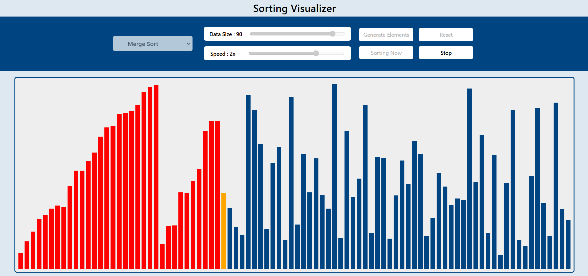

# Sorting Visualizer 🎨📊

A simple web-based **Sorting Visualizer** built with **HTML, CSS, and JavaScript**.  
It helps to understand how different sorting algorithms work by visualizing the step-by-step process.

---

## 🚀 Features
- Visualize popular sorting algorithms
- Adjustable speed of visualization
- Color-coded bars for better understanding
- User-friendly interface

---

## 📚 Algorithms Implemented
- Bubble Sort
- Selection Sort
- Insertion Sort
- Merge Sort
- Quick Sort

---

## 🖼️ Project Preview



---

## 🛠️ Technologies Used
- **HTML** – Structure of the page
- **CSS** – Styling and animations
- **JavaScript (ES6)** – Sorting logic & visualization

---

## ⚡ How to Use
1. Clone this repository:
```bash
   git clone https://github.com/your-username/sorting-visualizer.git
```
   
